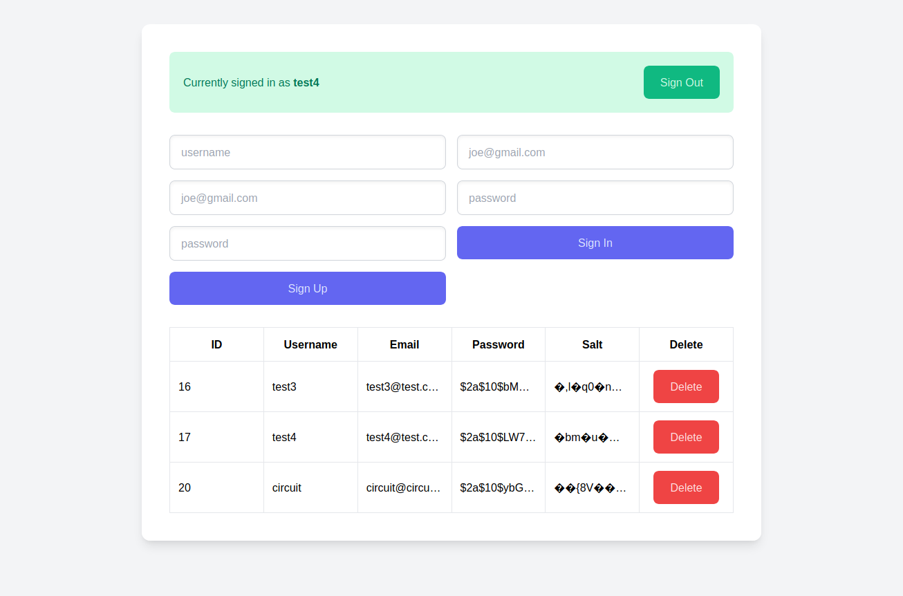

Simple backend REST API with auth written in Go.

Features:

-   SQLite database (ORM used: GORM)
-   Secure auth (passwords encrypted and salted)
-   User sessions (in-memory session store)
-   Basic html dashboard

Libraries/packages used:

-   ORM: [GORM](https://github.com/go-gorm/gorm)
-   Web Framework: [Gin](https://github.com/gin-gonic/gin)
-   Session middleware: [Gorilla Sessions](https://github.com/gorilla/sessions)
-   CSS Framework: [Tailwind](https://tailwindcss.com/)
-   JS Framework: [Alpine](https://github.com/alpinejs/alpine)
